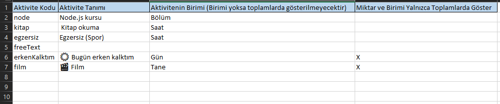
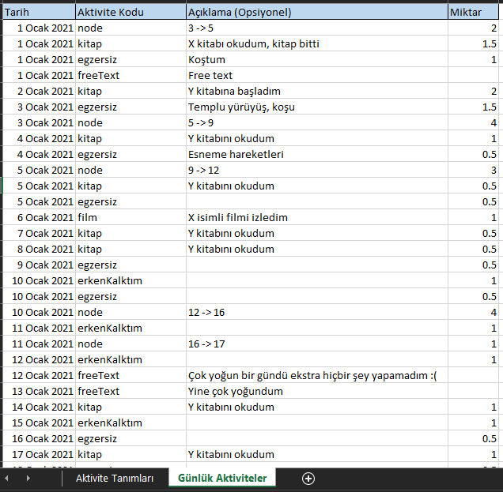
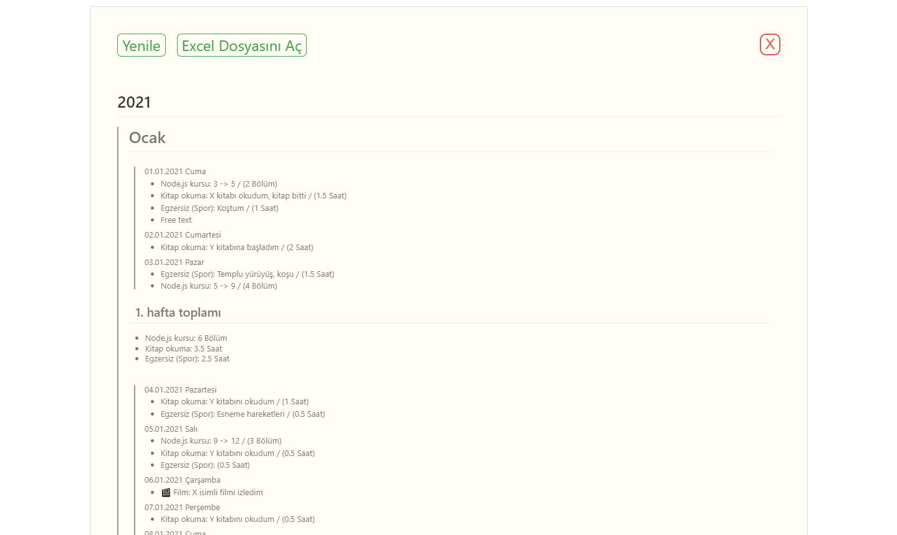
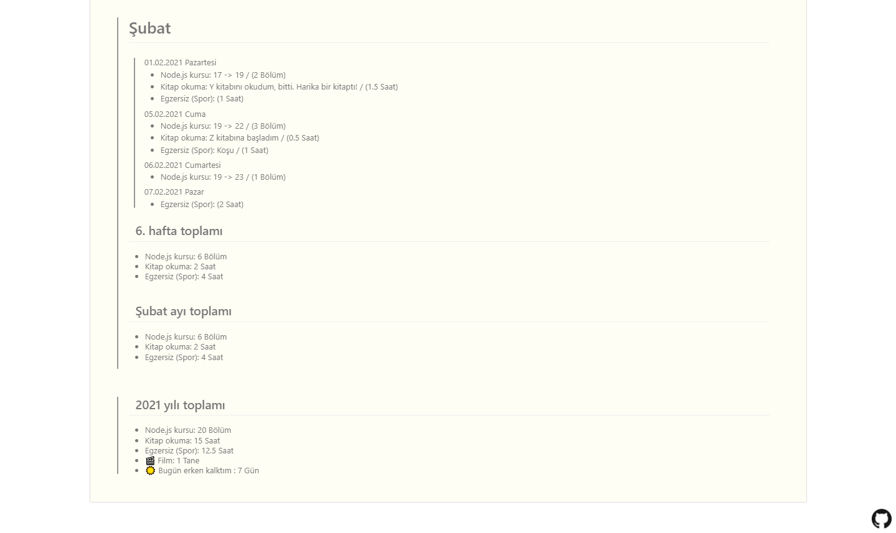

# 2021-gunluk

## Çalıştırmak İçin

- `npm install -g electron`
- Proje dizininde;
- `npm install`
- `electron .`

# &nbsp;

## Build Almak İçin

- `npm install -g electron-packager`
- Proje dizininde;
- `electron-packager ./`

# &nbsp;

## Ekran Görüntüleri

### Excel dosyası örnekteki gibi doldurulur

  

&nbsp;

### Excel dosyasından alınan bilgiler aşağıdaki gibi programda listelenir

